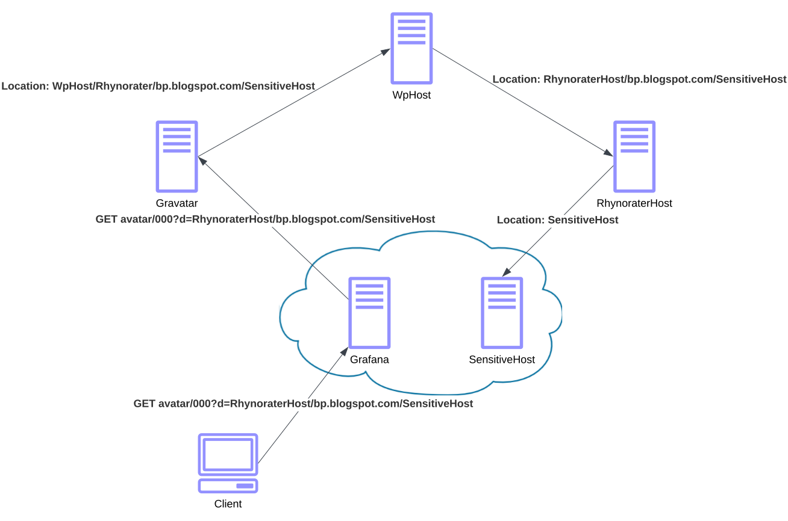

# dotnet-aws-ssrf-lab
## En SSRF-attack, vad är det? 

**Server Side Rquest Forgery** är [nummer 10 på OWASP top 10](https://owasp.org/Top10/A10_2021-Server-Side_Request_Forgery_%28SSRF%29/). Genom att utnyttja ovaliderad url-indata får du en betrodd endpoint att hämta saker åt dig som det inte är meningen att du ska se, alternativt utföra något farligt. 

I våras visade Davis [denna film](https://www.youtube.com/watch?v=Uklsk1WZ2EU)https://www.youtube.com/watch?v=Uklsk1WZ2EU på Brown Bag Lunch som redogör för en attack riktad mot GitLab (egentligen Grafana) med inte mindre än 4 redirects. 

Rhynorater fick $12.000 för bedriften och write-up återfinns [här](https://rhynorater.github.io/CVE-2020-13379-Write-Up). 

Under BBL-visningen framfördes många kreativa förslag förutom standardförfaranden på hur man bör täppa igen hålen. [@camitz](https://github.com/camitz) har försökt efterlikna attacken i syfte att implementera motåtgärder. Detta är det repot. 

## Men mer om det senare...

Först ska vi lägga upp alla 5 värdar på AWS för att ha något att jobba mot. Det är planen för labb 1 på fredag, den 8 september, kl 13.

Värdarna är skrivna med [Minimal API](https://learn.microsoft.com/en-us/aspnet/core/tutorials/min-web-api?view=aspnetcore-7.0&tabs=visual-studio) (jmf controller based apu). 

Att lägga upp dem på AWS kan man göra på minst en miljard sätt. Sätt er i lag och gör som ni brukar eller lär er något som ni inte kunde innan!

Det är egentligen fritt fram men jag föreslår serverless, mer specifikt AWS Lambda. Eftersom det är C# finns det några olika varianter. Minimal APIs rakt upp i en Zip, varför inte kompilerat med NativeAOT _eller_ med det nya fräscha [.Net Lambda Annotations Framework](https://aws.amazon.com/blogs/developer/net-lambda-annotations-framework/).

För att koppla på publika endpoints kan man t ex lägga upp en API Gateway, eller så finns Lambda Function URLs. Utmaning: både Function URLs och Annotations Framework! 

Vad ska man använda för själva deployen? AWS SAM verkar fungera bra men även [dotnet lambda tools](https://docs.aws.amazon.com/lambda/latest/dg/csharp-package-cli.html).

Kika i [Route53](https://aws.amazon.com/route53/). Där finns lite domäner som är fritt fram att använda.

Och för själva deployen, utnyttja Visual Studio, Rider eller VSCode, vad ni kommer över. Eller bygg med CDK. Jag har redan börjat. Bygg en pipeline. Go wild!

## Lite resurser

* [https://zied-ben-tahar.medium.com/aws-lambda-function-urls-with-net-6-minimal-api-727b6d2087a5](https://zied-ben-tahar.medium.com/aws-lambda-function-urls-with-net-6-minimal-api-727b6d2087a5)
* [https://aws.amazon.com/blogs/developer/net-lambda-annotations-framework/](https://aws.amazon.com/blogs/developer/net-lambda-annotations-framework/)
* James Eastman: [https://youtu.be/Tx4qxNV4rqY?si=NvF_lwSaSTsLqoVi](https://youtu.be/Tx4qxNV4rqY?si=NvF_lwSaSTsLqoVi) och [https://youtu.be/ZtXWIKrZSMQ?si=lLaaHF7RamNPAO8j](https://youtu.be/ZtXWIKrZSMQ?si=lLaaHF7RamNPAO8j)
## Förberedelser

Alla de som anmäls genom Henrik/Grönis kommer jag bjuda in till repot och mitt AWS-konto. Alternativt kan vi skriva till mig på Slack.
